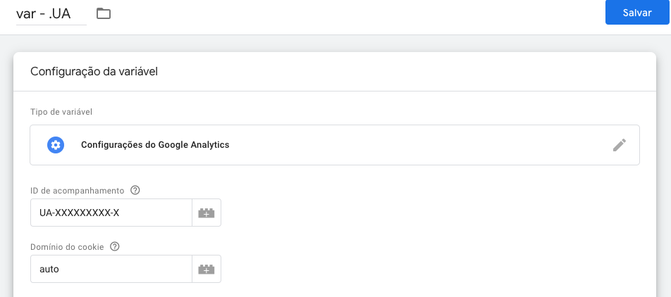
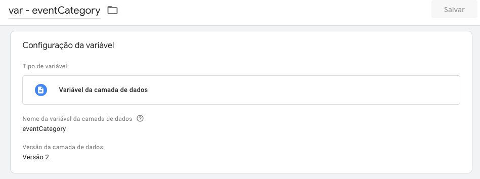
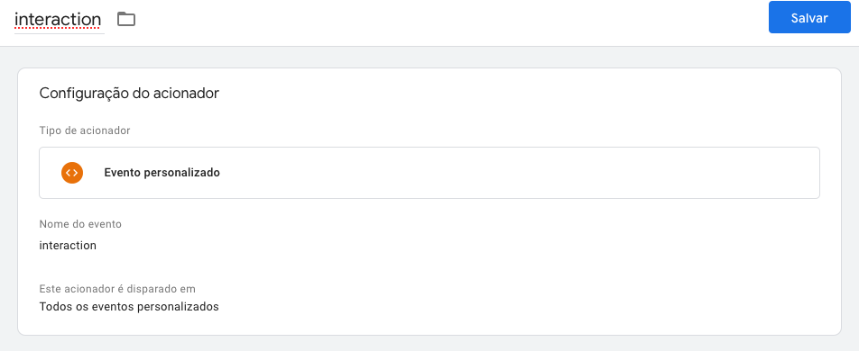
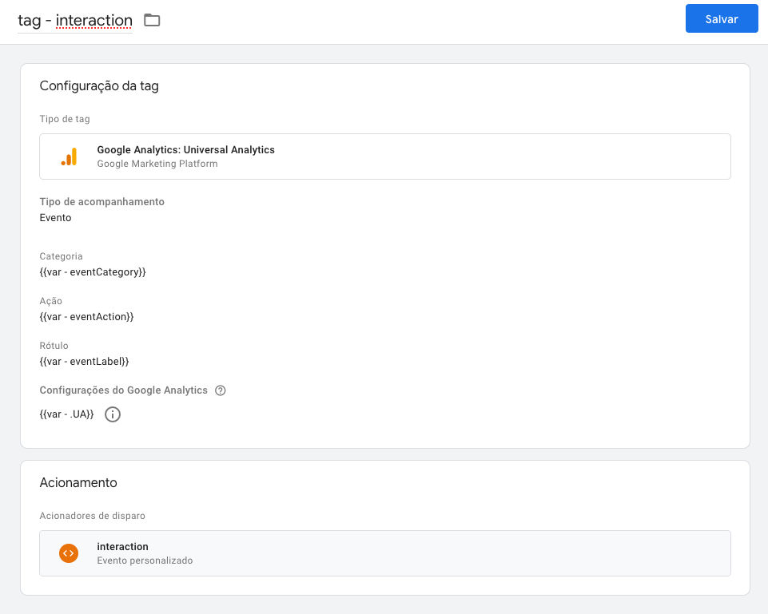

# **Curso de Google Tag Manager e Analytics**

> Nome e produtores não serão citados.
> Nem conteúdo na íntegra será escrito neste repositório.


## **GTM: O que é?**

Uma ferramenta que age como um intermediário entre seu site e ferramentas de terceiros (Google Analytics, Hotjar, Facebook Pixel, etc). Você pode concentrar todos os scripts nele e escolher quando dispará-los.

É de grande auxílio para profissionais de marketing que tem necessidade de adicionar e remover tags de remarketing, mensurar promoções de campanhas e gerar relatórios pois após a inserção do GTM tudo pode ser realizado por meio de um `Dashboard` (Painel de Controle) sem auxílio de pessoas desenvolvedoras.

Essa solução pode ser dispensável para sites pequenos como blogs pessoais que não necessitam de tags de parceiros ou remarketing, que não envolvam monetização ou venda de produtos, que já possuam relatórios de acessos básicos (como Wordpress, WIX e similares) pois exige certo esforço por possuir uma curva de aprendizado e certa complexidade.

## **O que é aconselhável saber para começar a mexer com o GTM?**

Na minha opinião, desconsiderando a parte de implementação, seria suficiente:

- O básico de Javascript para funções customizadas: [Learn JavaScript - Full Course for Beginners](https://www.youtube.com/watch?v=PkZNo7MFNFg)
- Uma pitada de CSS e seletores: [#GTMTips: 10 Useful CSS Selectors](https://www.simoahava.com/gtm-tips/10-useful-css-selectors/) e [CSS Selector Reference](https://www.w3schools.com/cssref/css_selectors.asp)
- E um pouco de Google Analytics: [Google Analytics para iniciantes](https://analytics.google.com/analytics/academy/course/6)


### **Como criar uma conta do Google Tag Manager?**

Você pode acessar o serviço pela url: [https://tagmanager.google.com/](https://tagmanager.google.com/) com sua conta do Google;  
Depois é possível criar uma conta. Por exemplo, se você tem um site próprio, a conta seria do seu site; se você trabalha de freelancer, teria provavelmente o nome da empresa que você presta serviços.


### **Como instalar o GTM no meu site?**

Para que o GTM funcione em seu site é necessário adicionar um bloco de código Javascript em seu site que será automaticamente disparado no momento do carregamento da página. Esse bloco de código é exibido para você assim que criar um `container` ou acessando a opção `Administrador > Instalar o Gerenciador de tags do Google`.

Você pode seguir as orientações [conforme diz a documentação](https://support.google.com/tagmanager/answer/6103696?hl=pt-BR) e, além disso tenho esse vídeo para recomendar: [Google Tag Manager: O que é e como instalar?](https://www.youtube.com/watch?v=7y0uSS2TQQI) e este post [How to Setup and Install Google Tag Manager on your Website](https://www.analyticsmania.com/post/how-to-install-google-tag-manager/).

Numa Single Page Application é um pouco diferente, imagine que você terá o GTM para os ambientes de PROD e QA, se você utilizou o `create-react-app` que possui Webpack ou configurou uma aplicação com Webpack e tem à disposição o [HtmlWebpackPlugin](https://webpack.js.org/plugins/html-webpack-plugin/) é possível [criar variáveis](https://stackoverflow.com/questions/49375867/how-do-you-reference-a-process-env-variable-in-html-script-src-react) nos arquivos `.env.production` e `.env.staging` (pasta raíz do seu projeto) e utilizá-las com `%%`, assim: 

```
<!-- Google Tag Manager -->
<script>(function(w,d,s,l,i){w[l]=w[l]||[];w[l].push({'gtm.start':
new Date().getTime(),event:'gtm.js'});var f=d.getElementsByTagName(s)[0],
j=d.createElement(s),dl=l!='dataLayer'?'&l='+l:'';j.async=true;j.src=
'https://www.googletagmanager.com/gtm.js?id='+i+dl;f.parentNode.insertBefore(j,f);
})(window,document,'script','dataLayer',%REACT_APP_GTM_ID%);</script>
<!-- End Google Tag Manager -->
```

#### E aqui nós temos as seguintes preocupações:

1. E se o seu caso for diferente do citado acima? Se você estiver utilizando alguma outra ferramenta de build, como o [esbuild](https://github.com/evanw/esbuild) ou utilizando uma ferramenta com Server-side rendering, como o NextJS, por exemplo.
2. Mesmo sendo seu caso e você tendo conseguido inserir o código com a ajuda do Webpack, o que você fará quando a rota mudar e perceber que o evento de visualização de página não foi disparado?
3. Por fim, e se eu te dissesse que seus testes unitários com `react-scripts test` podem quebrar por causa dessa implementação?

A primeira opção que encontrei está neste artigo chamado [Integrating Google Tag Manager with a React App](https://medium.com/finnovate-io/integrating-google-tag-manager-with-a-react-app-5a8584ee2251) onde o autor utiliza o pacote [react-gtm-module](https://github.com/alinemorelli/react-gtm) e condiz com a estratégia dos especialistas do AnalyticsMania neste post: [How To Track Single Page Web App with Google Tag Manager](https://www.analyticsmania.com/post/single-page-web-app-with-google-tag-manager/). Francamente, **essa solução não foi testada** pois o objetivo não era adicionar mais uma dependência no projeto.

#### Então como procedemos na história?

1. Criação da pasta `/src/config` e um arquivo `index.js` [contendo este código](https://gist.github.com/felipexperto/9f778a355a4580fe46aebfd8eed93600) para expor as variáveis de ambiente dos arquivos `.env`s;
2. Criação da pasta `/src/utils/gtm` e um arquivo `index.js` [contendo este código](https://gist.github.com/felipexperto/7f5e362ed04ec43c28a2d0995175172a). Repare que importamos o arquivo `config` e passamos o ID do GTM com `config.REACT_APP_GTM_ID`;
3. E efetuamos a chamada dentro do componente `Root` da aplicação com useEffect: 

```
import React, { useEffect } from 'react';
import gtm from 'utils/gtm';

const Root = ({ children }) => {
  useEffect(() => {
    gtm();
  }, []);

  return <div>Seu conteúdo está aqui</div>;
}

```

#### Isso ainda não resolveu o caso dos testes unitários, certo? Então, vamos:

1. Perceba que no gist dos `.env`s nós temos `REACT_APP_SELF_ENV`, isso serve como um `NODE_ENV` que nós podemos sobrepor. Sendo assim, vamos passá-la no `package.json` para nosso comando de teste: `"test": "REACT_APP_SELF_ENV=test react-scripts test"`;
2. Agora crie um arquivo de helper de sua preferência com a função: `export const isTestEnv = () => config.REACT_APP_SELF_ENV === 'test';`
3. Vamos importar seu helper no arquivo do componente `Root` e editar o `useEffect`:

```
import React, { useEffect } from 'react';
import gtm from 'utils/gtm';
import { isTestEnv } from 'utils/helpers'; // meu helper

const Root = ({ children }) => {
  useEffect(() => {
    if ( !isTestEnv ) {
      gtm();
    }
  }, []);

  return <div>Seu conteúdo está aqui</div>;
}

```

#### E como você alternará os IDs de GTM agora?

Passando a variável de ambiente nos seus comandos do `package.json`, por exemplo:

```
"build:qa": "REACT_APP_SELF_ENV=staging npm run build",
"build:production": "REACT_APP_SELF_ENV=production npm run build",
```

#### E a troca de rotas que não dispara o pageview?

Se você está utilizando `create-react-app` provavelmente também está usando `react-router-dom` e `react-helmet`, neste caso, podemos utilizar o hook `useLocation()` e deixei um [exemplo disponível aqui](https://github.com/felipexperto/gtm_cra).

E se você está indo de `NextJS`, procure por [router.events](https://nextjs.org/docs/api-reference/next/router#routerevents), mais especificadamente `routeChangeComplete`, toda vez que a rota mudar, este gatilho é disparado e, é nesse momento que você deverá disparar um evento personalizado de dataLayer. 

E se você está com `Gatsby`, pode levantar as mãos para o céu, pois ele tem plugins pra resolver esse tipo de problema: [gatsby-plugin-google-tagmanager](https://www.gatsbyjs.com/plugins/gatsby-plugin-google-tagmanager/) e [gatsby-plugin-google-analytics](https://www.gatsbyjs.com/plugins/gatsby-plugin-google-analytics/). Você vai instalar os dois seguindo as instruções, no caso do GTM, [serão dadas instruções](https://www.gatsbyjs.com/plugins/gatsby-plugin-google-tagmanager/#tracking-routes) para você configurar uma `TAG` no próprio Google Tag Manager e adicionar o parâmetro `routeChangeEventName` como `options` no `gatsby-plugin-google-tagmanager` pois o Gatsby disparará na mudança de rota esse evento. Eu escolhi o nome de `virtualPageView`.

Caso tenha problemas com o objeto `window`, pode editar o arquivo `gatsby-config.js`;

```
const windowGlobal = typeof window !== 'undefined' && window;

{
    resolve: `gatsby-plugin-google-tagmanager`,
    options: {
      id: 'GTM-XXXXXX',
      defaultDataLayer: {
        pageType: windowGlobal.pageType,
        routeChangeEventName: "virtualPageView",
      },
    },
  },
```


# **Conceitos**

## **Containers**

Dentro das contas você pode criar vários `containers`.  
Se você tem familiaridade com o Google Analytics pode fazer a seguinte comparação: Os `containers` são a mesma coisa que as `propriedades`.  
[O próprio Google não explica direito o que são containers](https://developers.google.com/tag-manager/api/v1/reference/accounts/containers?hl=pt), então vamos para um exemplo prático:

Imagine que você trabalhe na PepsiCo e a empresa necessite instalar o GTM nos sites dos produtos: Pepsi, Gatorade, H2OH! e Lipton.  
O primeiro passo é entrar no site do [Google Tag Manager](https://tagmanager.google.com/) e criar uma conta com um container.
Só que em cada site/portal haverão estruturas de código, formulários e objetivos diferentes por parte da empresa.  
Concorda comigo que ficaria uma bagunça se você implementasse o mesmo GTM em todos eles? Nesse momento entram em ação os `containers`.  

- A conta que engloba tudo se chamaria: `PepsiCo`;
- Dentro desta conta, haveriam os containers: `Pepsi`, `Gatorade`, `H2OH!` e `Lipton`;
- Cada container teria seu código específico, por exemplo: `GTM-NJHF654`, `GTM-N2PFK50`, `GTM-ABC1234` e `GTM-0JKB87F`;
- Você implementaria cada um dos códigos em seus respectivos sites.


## Workspace (ou Espaço de trabalho)

Tendo uma conta gratuita (como a nossa), é possível ter simultaneamente até três `workspaces` e, para que eles servem?  
Imagine que você já tem algumas regras em produção no seu GTM e quer adicionar outras, porém, está com receio de quebrar tudo (quem nunca?), eis que surgem os `workspaces`.

Quando você cria um novo workspace, ele será uma cópia do seu Workspace Padrão (atual) e isso quer dizer que todo o conteúdo publicado até agora, será parte desse novo espaço de trabalho. Então, a partir daí, você poderá fazer alterações e visualizá-las tranquilamente. Quando terminar, basta `Publicar` as alterações e essa nova versão com suas modificações será a mais recente e ativa no site.

> Vídeo recomendado: [Google Tag Manager: Como adicionar e remover tags e scripts do seu site](https://www.youtube.com/watch?v=FECpDfHd_wU&list=PLjm8rxH__HzIFyEFDukCqTdWA3-oiSqRW&index=2)

## **Tags (etiquetas), Triggers (acionadores) e Variables (variáveis)**

- `Tags` (o quê) são pedaços de código que fazem algo, por exemplo, trackear uma página, enviar um evento para o Google Analytics ou plataformas de terceiros;
- `Trigger` (quando) é uma condição de quando uma tag deve ser disparada;
- `Variáveis` (o que/como/onde) são pequenos pedaços de informação que podem ser reutilizados em tags e gatilhos;


## **Variables (variáveis) em detalhes**

No painel lateral do GTM existe a opção `Variáveis` onde temos as `variáveis incorporadas` que permitem captar dados da página ao interagir com a mesma sem necessidade de código. Você pode ver todas elas clicando no botão `Configurar` e ativar as que lhe fazem sentido.

Por exemplo, `Click Text` é uma variável incorporada que permite captar o texto do elemento num evento de clique.  
Você pode criar uma tag, escolher o modelo `Google Analytics: Universal Analytics` e adicionar no rótulo (por exemplo) a variável, escrevendo: `{{Click Text}}`.


## **Triggers (acionadores) em detalhes**

No painel lateral do GTM existe a opção `Acionadores` que exibe uma lista vazia ao criar o container.  
Ao clicar no botão de Adicionar um novo acionador, uma tela é aberta e a primeira ação é escolher o `tipo de acionador`.  
A nomenclatura - pelo menos pra mim - causou estranheza no início mas faz total sentido ter um `tipo` dentro do seu acionador pois existem diversos contextos onde podem ser aplicados.


## **Datalayer**

Uma camada "invisível" onde informações importantes sobre a página, compra ou interação é armazenada.  
Ele pode receber informação de diversos modos e o GTM pode ser configurado para pegar essas informações do dataLayer e enviar para o Google Analytics, Google Ads ou algum outro.


Um possível cenário é o abaixo, onde ocorre uma interação, um Auto Event Listener está escutando, envia para o dataLayer e, então o GTM pega essa informação e passa para alguma ferramenta, GA, por exemplo.


# **Criar um evento personalizado de dataLayer...** 🤔

Vamos imaginar o cenário onde queremos disparar um evento chamado `interaction` quando o usuário interagir com alguns elementos específicos. Para isso será necessário criar um evento personalizado.

> Os eventos personalizados são usados para acompanhar as interações que ocorrem no seu site ou app para dispositivos móveis que não são tratadas pelos métodos padrão. O caso de uso mais comum é quando você quer monitorar envios de formulários, mas o comportamento padrão do formulário foi alterado (por exemplo, o evento de navegador submit foi modificado). - [Google Tag Manager](https://support.google.com/tagmanager/answer/7679219?hl=pt-BR)

Esse evento precisará ter uma categoria (`category`), ação (`action`) e rótulo (`label`). Usarei nomes que acredito serem intuitivos mas você pode nomear como quiser.

## **Parte I - Configurações no GTM**

1. Criar uma variável `var - .UA` de `Configurações do Google Analytics` (se não houver) para que possamos enviar as informações capturadas para a conta do GA;




2. Criar as seguintes [Variáveis de camada de dados](https://support.google.com/tagmanager/answer/6164391?hl=pt-BR#:~:text=Configurar%20a%20vari%C3%A1vel%20da%20camada,de%20dados%20como%20o%20tipo.): `eventCategory`, `eventAction` e `eventLabel`




3. Criar um acionador(`trigger`) que será um `Evento personalizado` chamado `interaction` e será disparado em `Todos os eventos personalizados`.




4. Por fim, criar uma tag chamada `interaction` com "Tipo de acompanhamento" sendo `Evento`; `eventCategory` no campo "Categoria"; `eventAction` no campo "Ação"; `eventLabel` no campo "Rótulo"; Nossa variável de Universal Analytics `var - .UA` no campo "Configurações do Google Analytics"; E, nosso acionador `interaction` no campo "Acionadores de Disparo";



5. Clique no painel lateral esquerdo em "Visão Geral", confira se as alterações estão na lista "Alterações no espaço de trabalho" e em "Visualizar" para ativar o `Preview` ou "Enviar" para publicar as alterações.

6. A parte no GTM foi concluída e finalmente podemos disparar o evento via código.

## **Parte II - Disparando o evento via código**

Naturalmente existe toda uma [documentação sobre datalayer (ou Camada de Dados)](https://developers.google.com/tag-manager/devguide?hl=pt_br) e [eventos personalizados](https://support.google.com/tagmanager/answer/7679219?hl=pt-BR) escrita pelo Google e que aconselho a leitura posteriormente. No momento vamos continuar nessa levada.

Considerando que sua página já possua o código de implementação do Google Tag Manager no `<head>` conforme pede a documentação, o próximo passo é iniciar o dataLayer:

```
window.dataLayer = window.dataLayer || [];
```

Sim, essa única layer iniciou o dataLayer. A princípio ele não é mais nada do que um array vazio.  
A medida que os eventos acontecem nós vamos dando `pushs` e com as configurações que fizemos no GTM, ele cuida do resto.

É importante dizer que o dataLayer deve ser iniciado uma vez por página, portanto, essa linha deve aparecer uma única vez e não ser executada a cada interação. Se ao trocar de rota numa Single Page Application você quer indicar que uma nova página foi carregada, vai precisar criar um evento pra isso.

Se você está lidando com **Javascript puro**, para garantir que esta linha só seja executada após o carregamento do script do GTM, pode disparar este código na [função onload](https://developer.mozilla.org/pt-BR/docs/Web/API/GlobalEventHandlers/onload) da página ou utilizar [document.onreadystatechange](https://developer.mozilla.org/pt-BR/docs/Web/API/Document/readyState).

**Com jQuery** você tem o [evento load](https://api.jquery.com/load-event/): `$(window).on('load', function() {});` ou `$( window ).load(function() {});`

**Com React** temos algumas opções, se você está lidando com uma Single Page Application comum ( `create-react-app` ou similar ), a primeira proposta é ao iniciar seu componente:

```
const SeuComponente = () => {
  window.dataLayer = window.dataLayer || [];
}
```

Se você está lidando com SSR (Server-side rendering) ou SSG (Static Site Generator), por exemplo, NextJS ou Gatsby, pode ser que você tenha problemas com o objeto `window` não sendo encontrado porque ele não existe a não ser que você esteja no browser, sendo assim:

```
const SeuComponente = () => {
  let datalayerComponent = null;
  if (typeof window === 'undefined') {
    datalayerComponent = [];
  } else {
    datalayerComponent = window.dataLayer ? window.dataLayer : [];
  }
}
```


 opção do hook useEffect()

```
window.dataLayer = window.dataLayer || [];
window.dataLayer.push({
  'event': 'interaction',
  'eventCategory': 'cadastro:candidato',
  'eventAction': 'clicou:[[cta-texto]]',
  'eventLabel': '[[idioma]]',
  'eventValue': 0,
});
```

# **_Custom Dimensions_ e _metrics_ no Google Analytics**

## **Introdução**

A maioria dos relatórios do Google Analytics serão semelhantes à isso aqui:


### **Dimensions**

**Dimensions** são atributos de dados (elementos, itens, interações).

Exemplos de dimensions:

- Page URL, Page Title
- Event category, event action, event label
- Product name, variant, id

Uma **dimension** pode ter o escopo de Hit, Session, User ou Product.  

- Hit: Se você quer que uma dimension inclua toda vez que um usuário visite uma página em particular ou performe uma ação em particular;
- Session: Organizar dados pela duração de uma sessão;
- User: Organizar dados por usuário.
- Product: Agrupar dados de um produto em particular;


### **Metrics**

**Metrics** são medidas quantitativas (números, porcentagens, tempo) que ajudam a metrificar as dimensions.

Exemplos de metrics:

- Número de visualizações de um vídeo
- Número de visualizações de um popup de email


## **Existe um limite de Dimensions e Metrics?**

A conta gratuita do GA permite criar até 20 Custom dimensions e 20 Custom metrics.


## **Debug - Resolvendo problemas comuns com GTM**

Esta seção tem objetivo de servir como "Perguntas frequentes" para quando as coisas não vão tão bem quanto gostaríamos.

Meu primeiro conselho é a leitura deste post: [32 Google Tag Manager Debugging and Testing Tips](https://www.analyticsmania.com/post/google-tag-manager-debugging-tips/)

E vamos à algumas perguntas comuns:

**Se uma tag não disparou quais são as possíveis razões? O que eu deveria conferir?**

- Talvez você não tenha ativado o modo de preview do GTM ou recarregado a página após as mudanças;
- O problema pode estar também no `trigger`, alguma condição pode não estar correta;
- Talvez a tag só dispare em containers publicados;

**Minha tag disparou sem ter nenhum gatilho**

- Ela pode fazer parte de uma `tag sequence` e por tanto, estar sendo chamada antes ou após alguma outra tag em específico. Verifique entre seus `triggers`.
- Talvez você esteja visualizando o preview de uma versão antiga e faltou recarregar o mesmo.

**Onde posso encontrar query parameters que foram enviados para o GA?**

- Na aba `Networks`;
- No plugin [Tag Assistant](https://chrome.google.com/webstore/detail/tag-assistant-legacy-by-g/kejbdjndbnbjgmefkgdddjlbokphdefk) e [Datalayer Inspector](https://chrome.google.com/webstore/detail/adswerve-datalayer-inspec/kmcbdogdandhihllalknlcjfpdjcleom);
- No [GA Debugger (ou GA Debug Mode)](https://chrome.google.com/webstore/detail/google-analytics-debugger/jnkmfdileelhofjcijamephohjechhna);

**É possível impedir um formulário de recarregar a página**

- Sim, este artigo aqui é bom: [#GTMTips: Prevent Clicks And Form Submits From Redirecting](https://www.simoahava.com/analytics/prevent-clicks-and-form-submits-redirect/)

Inclusive, você pode salvar o script acima no próprio console do Google Chrome abrindo-o, indo até a aba `Sources`, clicando na seta `>>` da barra lateral esquerda e escolhendo `Snippets`. Clique em `New Snippet`, cole o código na caixa de texto e salve.


### **Utilizando o Google Chrome Developer Tools**

> Lembre-se que uma tag disparada não quer dizer que os dados foram devidamente enviados para um plugin de terceiro.

Por isso, se você está disparando um evento para um plugin como Facebook Pixel, Hotjar, entre outros, não deixe de olhar a aba `Console` do Google Chrome Developer Tools e verificar se erros ocorreram. Assim como analisar a aba `Networks` procurando por chamadas com status de erro (4xx ou 5xx).

https://www.analyticsmania.com/post/google-tag-manager-debugging-tips/


### **Utilizando extensões para browser**

#### [Tag Assistant](https://chrome.google.com/webstore/detail/tag-assistant-legacy-by-g/kejbdjndbnbjgmefkgdddjlbokphdefk)

Neste artigo chamado [Google Tag Assistant Tutorial: 10 Tips For Efficient Work](https://www.analyticsmania.com/post/google-tag-assistant-tutorial/) você pode saber mais sobre como funciona esta extensão.

Ao trabalhar com `Single Page Applications` pode acontecer da extensão [Tag Assistant](https://chrome.google.com/webstore/detail/tag-assistant-legacy-by-g/kejbdjndbnbjgmefkgdddjlbokphdefk) te informar que existem duas ou mais instâncias do mesmo container e isso pode ser falso. Para comprovar a procedência desta informação, você pode analisar a aba `Networks` procurando por chamadas com nome `gtm.js` e se aparecer somente uma, está tudo Ok.


#### [Datalayer Inspector](https://chrome.google.com/webstore/detail/adswerve-datalayer-inspec/kmcbdogdandhihllalknlcjfpdjcleom)

Com esta extensão você poderá verificar os pushes realizados para o datalayer, conferir as request de GA, Facebook Pixel, e outras ferramentas de tracking, injetar um container GTM e bloquear/trocar scripts numa página.


### **Utilizando o Preview do Google Tag Manager**

Abaixo temos uma comparação dos nomes dos `Triggers` (gatilhos) como aparecem no Painel de Configurações do Google Tag Manager _vs_ Preview do Google Tag Manager. Ex.: `DOM Ready` corresponde à `gtm.dom`. Créditos da imagem à [AnalyticsMania](https://www.analyticsmania.com/).


