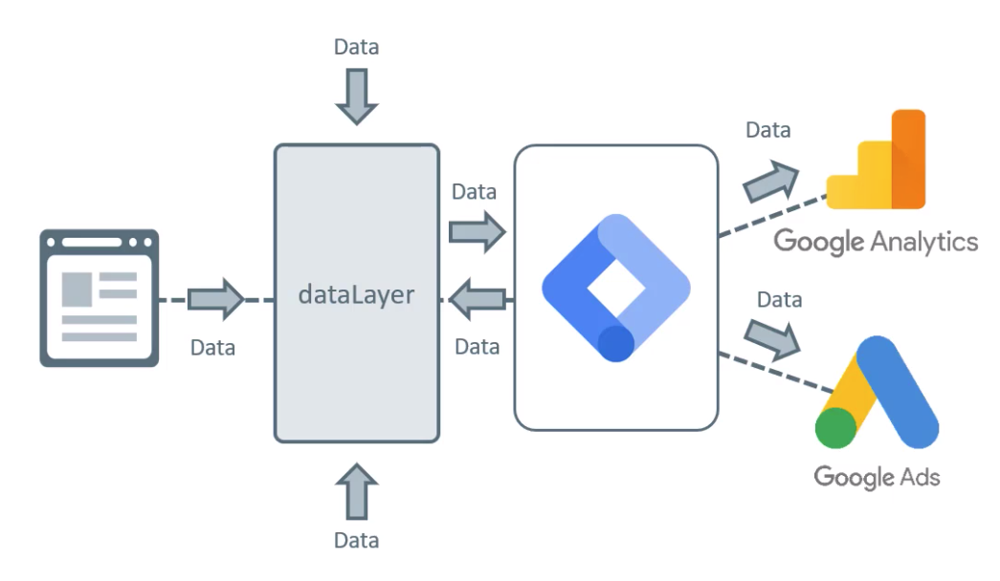
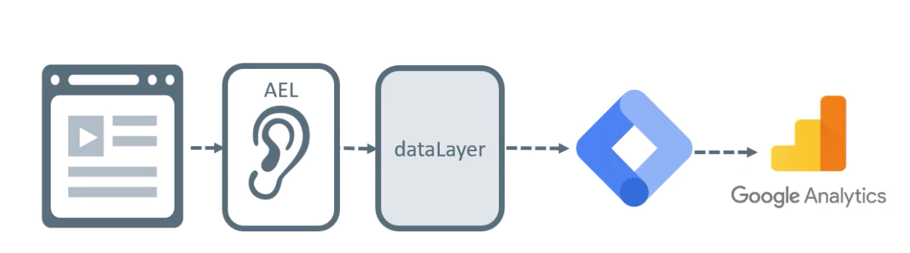
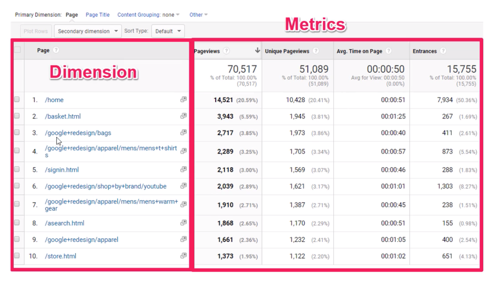
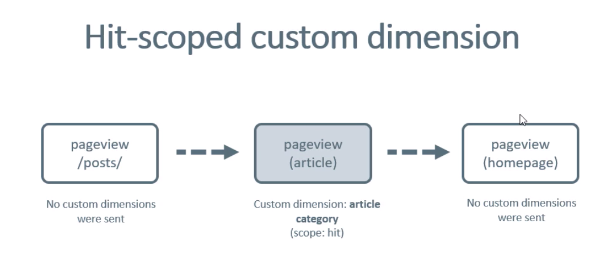
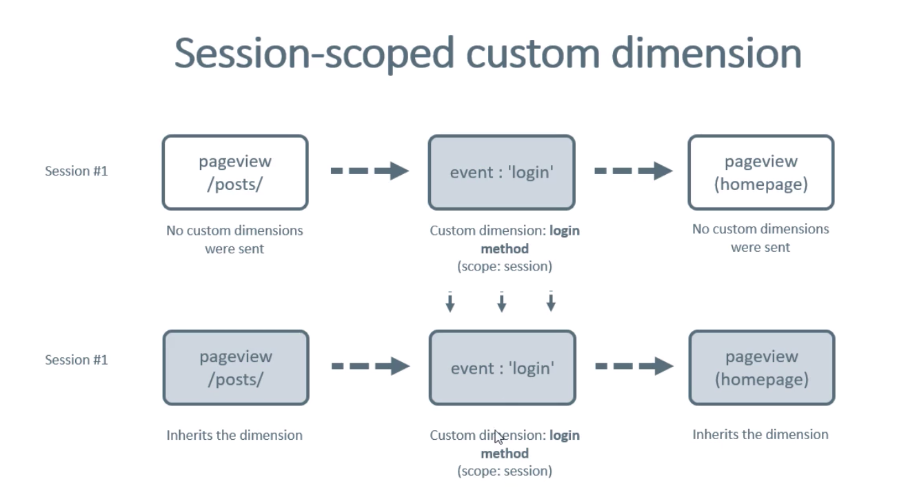
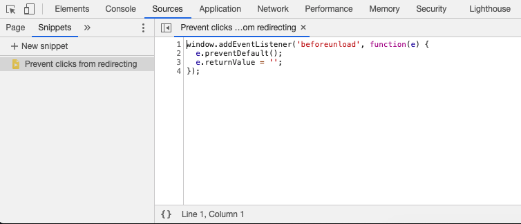
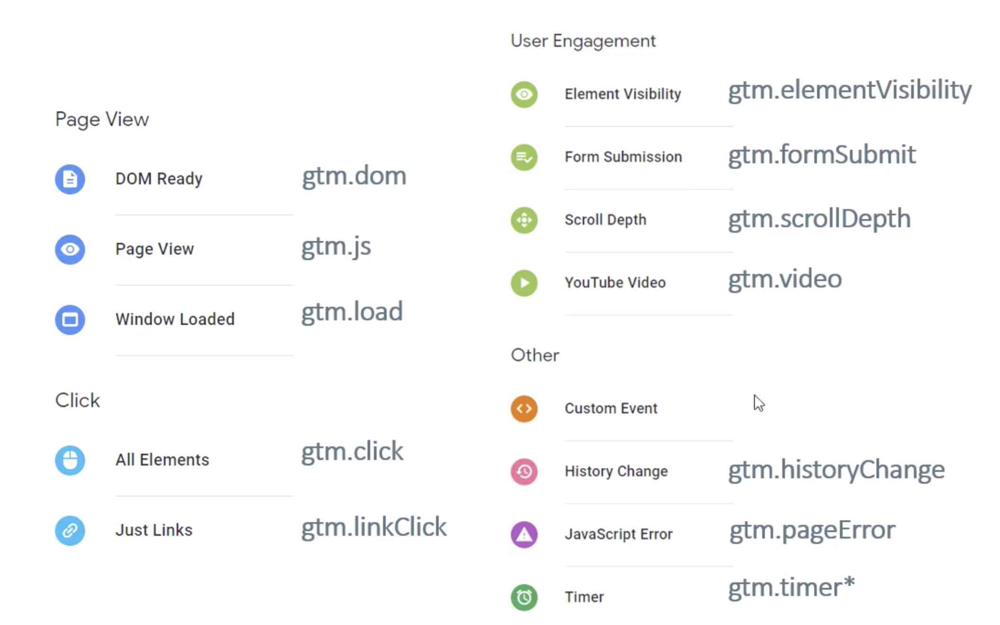

# **Curso de Google Tag Manager e Analytics**

> Nome e produtores não serão citados.
> Nem conteúdo na íntegra será escrito neste repositório.


## **O que devo saber para começar a mexer com o GTM?**

Na minha opinião:

- O básico de Javascript para funções customizadas: [Learn JavaScript - Full Course for Beginners](https://www.youtube.com/watch?v=PkZNo7MFNFg)
- Uma pitada de CSS e seletores: [#GTMTips: 10 Useful CSS Selectors](https://www.simoahava.com/gtm-tips/10-useful-css-selectors/) e [CSS Selector Reference](https://www.w3schools.com/cssref/css_selectors.asp)
- E um pouco de Google Analytics: [Google Analytics para iniciantes](https://analytics.google.com/analytics/academy/course/6)

# **Conceitos**

## **GTM**

Uma ferramenta que age como um intermediário entre seu site e ferramentas de terceiros (Google Analytics, Hotjar, Facebook Pixel, etc). Você pode concentrar todos os scripts nele e escolher quando dispará-los.

É de grande auxílio para profissionais de marketing que tem necessidade de adicionar e remover tags de remarketing, mensurar promoções de campanhas e gerar relatórios pois após a inserção do GTM tudo pode ser realizado por meio de um `Dashboard` (Painel de Controle) sem auxílio de pessoas desenvolvedoras.

Essa solução pode ser dispensável para sites pequenos como blogs pessoais que não necessitam de tags de parceiros ou remarketing, que não envolvam monetização ou venda de produtos, que já possuam relatórios de acessos básicos (como Wordpress, WIX e similares) pois exige certo esforço por possuir uma curva de aprendizado e certa complexidade.

### **Criando uma conta**

Você pode acessar o serviço pela url: [https://tagmanager.google.com/](https://tagmanager.google.com/) com sua conta do Google;  
Depois é possível criar uma conta. Por exemplo, se você tem um site próprio, a conta seria do seu site; se você trabalha de freelancer, teria provavelmente o nome da empresa que você presta serviços.
### **Instalação**

Para que o GTM funcione em seu site é necessário adicionar um bloco de código Javascript em seu site que será automaticamente disparado no momento do carregamento da página. Esse bloco de código é exibido para você assim que criar um `container` ou acessando a opção `Administrador > Instalar o Gerenciador de tags do Google`.

> Vídeo recomendado: [Google Tag Manager: O que é e como instalar?](https://www.youtube.com/watch?v=7y0uSS2TQQI)
## **Containers**

Dentro das contas você pode criar vários `containers`.  
Se você tem familiaridade com o Google Analytics pode fazer a seguinte comparação: Os `containers` são a mesma coisa que as `propriedades`.  
[O próprio Google não explica direito o que são containers](https://developers.google.com/tag-manager/api/v1/reference/accounts/containers?hl=pt), então vamos para um exemplo prático:

Imagine que você trabalhe na PepsiCo e a empresa necessite instalar o GTM nos sites dos produtos: Pepsi, Gatorade, H2OH! e Lipton.  
O primeiro passo é entrar no site do [Google Tag Manager](https://tagmanager.google.com/) e criar uma conta com um container.
Só que em cada site/portal haverão estruturas de código, formulários e objetivos diferentes por parte da empresa.  
Concorda comigo que ficaria uma bagunça se você implementasse o mesmo GTM em todos eles? Nesse momento entram em ação os `containers`.  

- A conta que engloba tudo se chamaria: `PepsiCo`;
- Dentro desta conta, haveriam os containers: `Pepsi`, `Gatorade`, `H2OH!` e `Lipton`;
- Cada container teria seu código específico, por exemplo: `GTM-NJHF654`, `GTM-N2PFK50`, `GTM-ABC1234` e `GTM-0JKB87F`;
- Você implementaria cada um dos códigos em seus respectivos sites (dentro do `<head>`, [como diz a documentação](https://support.google.com/tagmanager/answer/6103696?hl=pt-BR)):

```
<!-- Google Tag Manager -->
<script>(function(w,d,s,l,i){w[l]=w[l]||[];w[l].push({'gtm.start':
new Date().getTime(),event:'gtm.js'});var f=d.getElementsByTagName(s)[0],
j=d.createElement(s),dl=l!='dataLayer'?'&l='+l:'';j.async=true;j.src=
'https://www.googletagmanager.com/gtm.js?id='+i+dl;f.parentNode.insertBefore(j,f);
})(window,document,'script','dataLayer','ID-DO-GTM-VAI-EXATAMENTE-AQUI');</script>
<!-- End Google Tag Manager -->
```

## Workspace (ou Espaço de trabalho)

Tendo uma conta gratuita (como a nossa), é possível ter simultaneamente até três `workspaces` e, para que eles servem?  
Imagine que você já tem algumas regras em produção no seu GTM e quer adicionar outras, porém, está com receio de quebrar tudo (quem nunca?), eis que surgem os `workspaces`.

Quando você cria um novo workspace, ele será uma cópia do seu Workspace Padrão (atual) e isso quer dizer que todo o conteúdo publicado até agora, será parte desse novo espaço de trabalho. Então, a partir daí, você poderá fazer alterações e visualizá-las tranquilamente. Quando terminar, basta `Publicar` as alterações e essa nova versão com suas modificações será a mais recente e ativa no site.

> Vídeo recomendado: [Google Tag Manager: Como adicionar e remover tags e scripts do seu site](https://www.youtube.com/watch?v=FECpDfHd_wU&list=PLjm8rxH__HzIFyEFDukCqTdWA3-oiSqRW&index=2)

## **Tags (etiquetas), Triggers (acionadores) e Variables (variáveis)**

- `Tags` (o quê) são pedaços de código que fazem algo, por exemplo, trackear uma página, enviar um evento para o Google Analytics ou plataformas de terceiros;
- `Trigger` (quando) é uma condição de quando uma tag deve ser disparada;
- `Variáveis` (o que/como/onde) são pequenos pedaços de informação que podem ser reutilizados em tags e gatilhos;


## **Variables (variáveis) em detalhes**

No painel lateral do GTM existe a opção `Variáveis` onde temos as `variáveis incorporadas` que permitem captar dados da página ao interagir com a mesma sem necessidade de código. Você pode ver todas elas clicando no botão `Configurar` e ativar as que lhe fazem sentido.

Por exemplo, `Click Text` é uma variável incorporada que permite captar o texto do elemento num evento de clique.  
Você pode criar uma tag, escolher o modelo `Google Analytics: Universal Analytics` e adicionar no rótulo (por exemplo) a variável, escrevendo: `{{Click Text}}`.


## **Triggers (acionadores) em detalhes**

No painel lateral do GTM existe a opção `Acionadores` que exibe uma lista vazia ao criar o container.  
Ao clicar no botão de Adicionar um novo acionador, uma tela é aberta e a primeira ação é escolher o `tipo de acionador`.  
A nomenclatura - pelo menos pra mim - causou estranheza no início mas faz total sentido ter um `tipo` dentro do seu acionador pois existem diversos contextos onde podem ser aplicados.


## **Datalayer**

Uma camada "invisível" onde informações importantes sobre a página, compra ou interação é armazenada.  
Ele pode receber informação de diversos modos e o GTM pode ser configurado para pegar essas informações do dataLayer e enviar para o Google Analytics, Google Ads ou algum outro.



Um possível cenário é o abaixo, onde ocorre uma interação, um Auto Event Listener está escutando, envia para o dataLayer e, então o GTM pega essa informação e passa para alguma ferramenta, GA, por exemplo.




# **Até onde entendi sobre dataLayer...** 🤔

Para que ele funcione adequadamente, você deve (no GTM):

- Criar uma ou mais [Variáveis de camada de dados](https://support.google.com/tagmanager/answer/6164391?hl=pt-BR#:~:text=Configurar%20a%20vari%C3%A1vel%20da%20camada,de%20dados%20como%20o%20tipo.);  
Exemplo: Três variáveis cujos nomes são `eventCategory`, `eventAction` e `eventLabel`

- Linkar essas variáveis numa tag de evento `Universal Analytics`;  
Exemplo: Criar uma tag chamada `interaction` com `eventCategory` no campo "Categoria", `eventAction` no campo "Ação" e `eventLabel` no campo "Rótulo"

- Adicionar um acionador(`trigger`) na tag que será um `Evento personalizado`;  
Exemplo: Um evento chamado `interaction` e é disparado por `Todos os eventos personalizados`

- E finalmente podemos disparar o evento via código.  
```
window.dataLayer = window.dataLayer || [];
window.dataLayer.push({
  'event': 'interaction',
  'eventCategory': 'cadastro:candidato',
  'eventAction': 'clicou:[[cta-texto]]',
  'eventLabel': '[[idioma]]',
  'eventValue': 0,
});
```

# **_Custom Dimensions_ e _metrics_ no Google Analytics**

## **Introdução**

A maioria dos relatórios do Google Analytics serão semelhantes à isso aqui:



### **Dimensions**

**Dimensions** são atributos de dados (elementos, itens, interações).

Exemplos de dimensions:

- Page URL, Page Title
- Event category, event action, event label
- Product name, variant, id

Uma **dimension** pode ter o escopo de Hit, Session, User ou Product.  

- Hit: Se você quer que uma dimension inclua toda vez que um usuário visite uma página em particular ou performe uma ação em particular;
- Session: Organizar dados pela duração de uma sessão;
- User: Organizar dados por usuário.
- Product: Agrupar dados de um produto em particular;






### **Metrics**

**Metrics** são medidas quantitativas (números, porcentagens, tempo) que ajudam a metrificar as dimensions.

Exemplos de metrics:

- Número de visualizações de um vídeo
- Número de visualizações de um popup de email


## **Existe um limite de Dimensions e Metrics?**

A conta gratuita do GA permite criar até 20 Custom dimensions e 20 Custom metrics.


## **Debug - Resolvendo problemas comuns com GTM**

Esta seção tem objetivo de servir como "Perguntas frequentes" para quando as coisas não vão tão bem quanto gostaríamos.  
Meu primeiro conselho é a leitura deste post: [32 Google Tag Manager Debugging and Testing Tips](https://www.analyticsmania.com/post/google-tag-manager-debugging-tips/)

E vamos à algumas perguntas comuns:

**Se uma tag não disparou quais são as possíveis razões? O que eu deveria conferir?**

- Talvez você não tenha ativado o modo de preview do GTM ou recarregado a página após as mudanças;
- O problema pode estar também no `trigger`, alguma condição pode não estar correta;
- Talvez a tag só dispare em containers publicados;

**Minha tag disparou sem ter nenhum gatilho**

- Ela pode fazer parte de uma `tag sequence` e por tanto, estar sendo chamada antes ou após alguma outra tag em específico. Verifique entre seus `triggers`.
- Talvez você esteja visualizando o preview de uma versão antiga e faltou recarregar o mesmo.

**Onde posso encontrar query parameters que foram enviados para o GA?**

- Na aba `Networks`;
- No plugin [Tag Assistant](https://chrome.google.com/webstore/detail/tag-assistant-legacy-by-g/kejbdjndbnbjgmefkgdddjlbokphdefk) e [Datalayer Inspector](https://chrome.google.com/webstore/detail/adswerve-datalayer-inspec/kmcbdogdandhihllalknlcjfpdjcleom);
- No [GA Debugger (ou GA Debug Mode)](https://chrome.google.com/webstore/detail/google-analytics-debugger/jnkmfdileelhofjcijamephohjechhna);

**É possível impedir um formulário de recarregar a página**

- Sim, este artigo aqui é bom: [#GTMTips: Prevent Clicks And Form Submits From Redirecting](https://www.simoahava.com/analytics/prevent-clicks-and-form-submits-redirect/)

Inclusive, você pode salvar o script acima no próprio console do Google Chrome abrindo-o, indo até a aba `Sources`, clicando na seta `>>` da barra lateral esquerda e escolhendo `Snippets`. Clique em `New Snippet`, cole o código na caixa de texto e salve.




### **Utilizando o Google Chrome Developer Tools**

> Lembre-se que uma tag disparada não quer dizer que os dados foram devidamente enviados para um plugin de terceiro.

Por isso, se você está disparando um evento para um plugin como Facebook Pixel, Hotjar, entre outros, não deixe de olhar a aba `Console` do Google Chrome Developer Tools e verificar se erros ocorreram. Assim como analisar a aba `Networks` procurando por chamadas com status de erro (4xx ou 5xx).

https://www.analyticsmania.com/post/google-tag-manager-debugging-tips/


### **Utilizando extensões para browser**

#### [Tag Assistant](https://chrome.google.com/webstore/detail/tag-assistant-legacy-by-g/kejbdjndbnbjgmefkgdddjlbokphdefk)

Neste artigo chamado [Google Tag Assistant Tutorial: 10 Tips For Efficient Work](https://www.analyticsmania.com/post/google-tag-assistant-tutorial/) você pode saber mais sobre como funciona esta extensão.

Ao trabalhar com `Single Page Applications` pode acontecer da extensão [Tag Assistant](https://chrome.google.com/webstore/detail/tag-assistant-legacy-by-g/kejbdjndbnbjgmefkgdddjlbokphdefk) te informar que existem duas ou mais instâncias do mesmo container e isso pode ser falso. Para comprovar a procedência desta informação, você pode analisar a aba `Networks` procurando por chamadas com nome `gtm.js` e se aparecer somente uma, está tudo Ok.


#### [Datalayer Inspector](https://chrome.google.com/webstore/detail/adswerve-datalayer-inspec/kmcbdogdandhihllalknlcjfpdjcleom)

Com esta extensão você poderá verificar os pushes realizados para o datalayer, conferir as request de GA, Facebook Pixel, e outras ferramentas de tracking, injetar um container GTM e bloquear/trocar scripts numa página.


### **Utilizando o Preview do Google Tag Manager**

Abaixo temos uma comparação dos nomes dos `Triggers` (gatilhos) como aparecem no Painel de Configurações do Google Tag Manager _vs_ Preview do Google Tag Manager. Ex.: `DOM Ready` corresponde à `gtm.dom`. Créditos da imagem à [AnalyticsMania](https://www.analyticsmania.com/).




